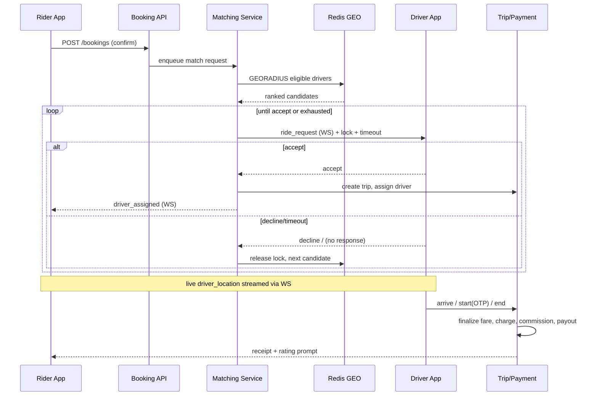
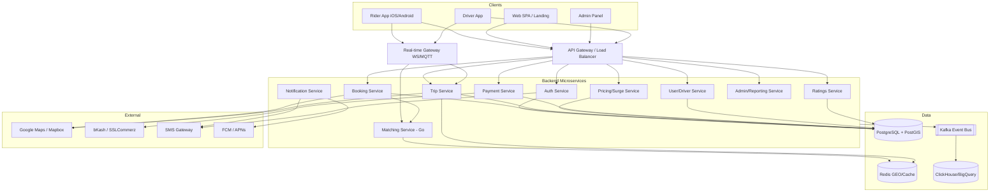

# Software Requirements Specification (SRS)
## BDcabs — Multi-Modal Ride-Hailing & Vehicle Rental Platform

**Document version:** 1.1 (aligned with role_wise_story.md — 7 roles, coupons, money flow)
**Date:** 2026-06-17
**Status:** Draft for review
**Prepared by:** Senior Software Architect
**System under specification:** BDcabs (Rider App, Driver App, Web Booking, Admin Panel, Backend Services)

---

## 1. Business Overview

### 1.1 Purpose
BDcabs is a technology platform that connects passengers in Bangladesh with vehicle supply (metered taxis, CNG autorickshaws, yellow cabs, and rental cars) through iOS, Android, and Web channels. The platform brokers on-demand and scheduled trips, handles fare calculation and digital payment, and provides operational tooling for dispatch, fleet quality, and finance.

### 1.2 Business Context
- **Market:** Urban Bangladesh — primary city Dhaka; expansion cities Chittagong, Sylhet, Khulna, Rajshahi.
- **Differentiators:** Multi-vehicle marketplace (one app for taxi, CNG, car rental, airport transfer); local payment rails (bKash, cash); driver training/audit program for standardized service quality.
- **Service lines:**
  1. **On-demand ride** — instant matching to nearest available driver.
  2. **Scheduled ride / pre-booking** — book for a future time.
  3. **Rent-a-car** — hourly/daily hire, with or without driver.
  4. **Airport pickup & drop** — fixed-fare or metered.
  5. **Outstation / tours & travels** — multi-day, package-based.

### 1.3 Business Objectives
| # | Objective | Success Metric |
|---|-----------|----------------|
| BO-1 | Reduce time-to-match for riders | Median match time < 20s in core zones |
| BO-2 | Maximize driver utilization | Driver idle ratio < 35% during peak |
| BO-3 | Drive digital payment adoption | >= 50% of trips paid via bKash/card/wallet |
| BO-4 | Maintain service quality | Avg. rating >= 4.5; complaint rate < 2% |
| BO-5 | Support multi-city scale | Onboard a new city in < 2 weeks (config-driven) |

### 1.4 Revenue Model
- Commission per completed trip (% of fare, configurable per vehicle type/city).
- Rental margin on rent-a-car bookings.
- Surge/dynamic pricing uplift.
- Cancellation and waiting-time fees.
- Optional driver subscription / lead packages.

### 1.5 Scope
**In scope:** Rider apps (iOS/Android/Web), Driver app, Admin/operations panel, backend microservices, real-time matching, payments, ratings, notifications, reporting.
**Out of scope (v1):** In-house mapping/routing engine (use Google Maps/Mapbox), in-house payment processing (integrate bKash/SSLCommerz), corporate ERP integration.

---

## 2. User Roles

Canonical role definitions live in [`role_wise_story.md`](role_wise_story.md). The platform has **seven** primary roles plus an unauthenticated Guest.

| Role | Description | Account creation | Primary Channels |
|------|-------------|------------------|------------------|
| **Customer / Passenger** | Registered user who books, pays, rates trips. | Self-signup, active immediately | iOS, Android, Web |
| **Driver** | Vetted vehicle operator who accepts/completes trips; may rent a car from a Vehicle Owner. | Self-signup, pending until documents verified | Driver App (Android primary) |
| **Fleet / Vehicle Owner** | Owns vehicles, rents them to drivers, manages fleet, sees earnings. | Self-signup, verified before listing vehicles | Web portal |
| **Corporate Client** | Company booking transport for employees, billed periodically. | Self-signup, billing agreement approved first | Web portal, App |
| **Support Admin** | Operations: onboarding, verification, ride/trip monitoring, fraud, incidents, manual bookings, complaints. | Created by Super Admin | Admin Panel |
| **Finance Admin** | Money: driver/fleet payouts, corporate invoicing, refunds, commissions, financial reporting. | Created by Super Admin | Admin Panel |
| **Super Admin** | Full system configuration, pricing, fare-split, coupons, cities/zones, RBAC, audit. | Seeded at system setup | Admin Panel |
| **Guest** | Unauthenticated visitor; can browse, get fare estimates, view coverage. | n/a | Web, App |

> **Separation of duties:** Support Admin (operations) and Finance Admin (money) are deliberately split — the staff member who verifies a driver must not also approve that driver's payout. Operational sub-functions historically labelled "Dispatch", "City Manager", or "Support Agent" are duties of **Support Admin**; "Finance Officer" duties belong to **Finance Admin**.

### 2.1 Permission Model (RBAC)
Role -> Permission sets (scoped by city where relevant). Example scopes: `booking:create`, `booking:assign`, `pricing:edit`, `coupon:manage`, `payout:approve`, `invoice:generate`, `user:suspend`, `staff:create`, `report:view`, `config:global`. Staff accounts (`SupportAdmin`, `FinanceAdmin`) are created only by Super Admin. Every privileged action is audit-logged (actor, target, before/after, timestamp, IP).

---

## 3. Functional Requirements

### 3.1 Rider — Authentication & Profile
- **FR-1** Register/login via phone number + OTP (SMS); social login optional.
- **FR-2** Manage profile (name, email, photo, gender, emergency contact).
- **FR-3** Save favorite places (Home, Work, custom).
- **FR-4** Manage payment methods (cash, card, bKash, wallet).
- **FR-5** View ride history with invoices and re-book.

### 3.2 Rider — Booking
- **FR-6** Detect current location; set pickup via map pin or search (autocomplete).
- **FR-7** Set destination; system returns ETA, distance, and fare estimate per vehicle type.
- **FR-8** Select vehicle type (Taxi, CNG, Car, Yellow Cab, Rental).
- **FR-9** Choose **Ride now** or **Schedule for later** (date/time picker).
- **FR-10** Apply promo code; see fare breakdown (base + distance + time + surge - discount).
- **FR-11** Confirm booking -> enter matching state with live status.
- **FR-12** Track assigned driver on map in real time; see driver name, photo, rating, vehicle, plate.
- **FR-13** Contact driver via masked call / in-app chat.
- **FR-14** Cancel booking (with cancellation policy / fee rules).
- **FR-15** SOS / share trip with emergency contact.

### 3.3 Rider — Trip & Payment
- **FR-16** Receive trip start/end events; see live fare meter.
- **FR-17** Pay via selected method; auto-charge wallet/card or confirm cash.
- **FR-18** Rate driver (1-5) and leave feedback/tags; tip optionally.
- **FR-19** Report an issue / lost item / dispute a fare.

### 3.4 Rent-a-Car
- **FR-20** Browse rental packages (hourly/daily, with/without driver, vehicle category).
- **FR-21** Select date range, pickup point; see total cost incl. extras (driver allowance, fuel policy).
- **FR-22** Book and pay deposit/full; receive confirmation voucher.

### 3.5 Driver — Operations
- **FR-23** Driver registration with KYC document upload (license, NID, vehicle papers, photo).
- **FR-24** Go online/offline; set preferred vehicle type and zone.
- **FR-25** Receive ride requests with pickup, distance, fare, rider rating; accept/decline within timeout.
- **FR-26** Turn-by-turn navigation to pickup and drop (deep-link to Google Maps / embedded).
- **FR-27** Trip lifecycle: arrived -> start (OTP/verify) -> in-progress -> end.
- **FR-28** View earnings (daily/weekly), incentives, and trip history.
- **FR-29** Request payout / view wallet balance and commission deductions.
- **FR-30** Rate rider; report issues.

### 3.6 Support Admin — Operations (Dispatch)
- **FR-31** Create manual/call-center bookings on behalf of customers.
- **FR-32** Live map of all online drivers and active trips; monitor active trips.
- **FR-33** Manually (re)assign or cancel a trip; override driver.
- **FR-34** Monitor SLA breaches (long match time, stuck trips) with alerts.
- **FR-34a** Driver/vehicle/fleet/corporate onboarding & verification (approve/reject KYC).
- **FR-34b** Fraud detection: flag and investigate suspicious accounts/rides.
- **FR-34c** Incident & emergency management; act on SOS alerts.
- **FR-34d** Handle customer complaints and fare disputes; escalate refunds to Finance Admin.

### 3.7 Super Admin — Configuration & Management
- **FR-35** Manage all users, drivers, vehicles, fleet owners, corporate clients (CRUD, approve/suspend); create Support Admin & Finance Admin staff accounts.
- **FR-36** Configure pricing per city/vehicle type (base, per-km, per-min, minimum, surge rules, cancellation/waiting fees).
- **FR-36a** Configure the **fare-split / commission model** (platform commission, owner cut, driver earnings, coupon-cost owner) — see §3.13.
- **FR-37** Manage zones/geofences, airport fixed fares, service availability.
- **FR-38** Manage promotions, referral programs, and **coupons** — see §3.12.
- **FR-40** Reporting & analytics dashboards (trips, revenue, supply/demand, ratings).
- **FR-41** Content management (banners, notifications, FAQ, T&C).
- **FR-42** Role & permission management (RBAC) with audit logs.

### 3.7a Finance Admin — Money
- **FR-39** View transactions, reconcile gateway payments, process refunds (reversing coupon discount per cost owner), approve driver & fleet-owner payouts, compute commissions.
- **FR-39a** Generate corporate invoices and consolidated billing for Corporate Clients.
- **FR-39b** Financial reporting (revenue, tax, payout, coupon-cost).

### 3.8 Cross-cutting
- **FR-43** Push/SMS/email notifications for key events (match, arrival, receipt, promo).
- **FR-44** Multi-language (English, Bangla) and multi-currency-ready (BDT base).
- **FR-45** Surge/dynamic pricing engine driven by live supply-demand ratio per zone.

### 3.9 Fleet / Vehicle Owner
- **FR-46** Owner registration with company/owner KYC (trade license, NID, bank details); verified before listing vehicles.
- **FR-47** Register and manage vehicles with documents (registration, insurance, fitness) and expiry tracking; activate/deactivate or mark under maintenance.
- **FR-48** Add/remove drivers to the fleet; approve which driver can rent/drive which vehicle.
- **FR-49** Set rental terms and rental price to drivers (fixed daily rent or % revenue-share).
- **FR-50** Receive rent / revenue-share payments from drivers; view per-vehicle and per-driver revenue reports and settlement statements.
- **FR-51** Monitor vehicle performance and track vehicle location/status in real time.
- **FR-52** Give and receive ratings/reviews with Drivers and Corporate Clients.

### 3.10 Corporate Client
- **FR-53** Corporate registration with a billing/credit agreement, approved before transacting.
- **FR-54** Manage employee list (who can book under the company); set per-employee spending limits and approval rules.
- **FR-55** Book transportation for employees from a Fleet/Vehicle Owner (platform auto-allocation or selected fleet).
- **FR-56** Schedule recurring rides (e.g. employee shuttles) via recurrence rules.
- **FR-57** Manage company billing; receive consolidated invoices and trip/spend reports.
- **FR-58** Rate and review Fleet/Vehicle Owners.

### 3.11 Driver ↔ Owner Rental
- **FR-59** A rental driver browses vehicles offered for rent and requests one from a Fleet/Vehicle Owner.
- **FR-60** Owner approval assigns the vehicle to the driver under agreed terms; the driver may then go online with it.
- **FR-61** The driver pays rent to the Owner (fixed amount or auto-deducted revenue-share); overdue rent notifies both parties and may suspend the assignment.
- **FR-62** Driver and Owner exchange ratings/reviews after the rental period.
- **FR-63** Distinguish **owner-driver** (owns/drives platform car — rental FRs do not apply) from **rental driver** (rents from an Owner).

### 3.12 Coupons & Promotions
> Full rules in [`role_wise_story.md`](role_wise_story.md) → Coupon System. Owned by Super Admin; applied by Customers/Corporate; cost reconciled by Finance Admin.
- **FR-64** Coupon types: percentage (with max-discount cap), flat, free/capped ride, first-ride, referral.
- **FR-65** Coupon attributes: `code`, `type`, `value`, `max_discount`, `min_fare`, validity window, `usage_limit_total`, `usage_limit_per_user`, applicable cities/zones, applicable roles, `cost_borne_by` (platform/owner), `status`, `first_ride_only`.
- **FR-66** Apply-time validation: active & in-window, fare ≥ `min_fare`, eligible city/zone, per-user & total limits not exceeded, first-ride check, **one coupon per ride** (no stacking unless explicitly allowed).
- **FR-67** Lifecycle: Super Admin create/pause/expire; redemption locked on ride completion; released on cancellation; on refund Finance Admin reverses the discount per `cost_borne_by`.
- **FR-68** Discount cost is logged against `cost_borne_by` (platform = marketing expense/commission reduction; owner = reduces owner cut).

### 3.13 Money Flow & Fare Split
> Full description in [`role_wise_story.md`](role_wise_story.md) → Money Flow.
- **FR-69** On ride completion, split the fare per the configured model: **customer payment** (fare − coupon discount) → **platform commission** + **Vehicle Owner cut** + **driver earnings**.
- **FR-70** Driver → Owner rent is a separate recurring flow, independent of per-ride fare.
- **FR-71** Corporate billing is invoiced periodically, not charged per-ride at point of use.
- **FR-72** Every completed trip records its split (commission, owner cut, driver earning, discount, cost owner) for reconciliation.

---

## 4. Non-Functional Requirements

| Category | Requirement |
|----------|-------------|
| **Performance** | Fare estimate API p95 < 400 ms; match request dispatched to first driver < 2 s; live location update latency < 3 s. |
| **Scalability** | Horizontally scalable services; support 10k concurrent active trips and 100k online drivers (per region) via stateless services + sharded geo-index. |
| **Availability** | 99.9% monthly uptime for booking/matching; multi-AZ deployment; graceful degradation (cached fares if pricing service down). |
| **Reliability** | At-least-once delivery for trip events; idempotent payment operations; no double-charge. |
| **Security** | TLS 1.2+ everywhere; OAuth2/JWT auth; OWASP Top-10 hardening; encrypted PII at rest (AES-256); PCI-DSS scope minimized via tokenized card vault; phone-number masking for rider<->driver calls. |
| **Privacy/Compliance** | Bangladesh data-protection alignment; consent for location; data retention & deletion policy; audit trail for admin actions. |
| **Usability** | Booking flow <= 4 taps; accessible (WCAG 2.1 AA on web); offline-tolerant driver app (queue events, sync on reconnect). |
| **Maintainability** | Microservices with clear contracts; >= 80% critical-path test coverage; IaC; CI/CD. |
| **Observability** | Centralized logging, distributed tracing, metrics, real-time alerting; per-trip event timeline. |
| **Localization** | RTL-safe i18n framework; Bangla/English; local date/number formats. |
| **Resilience** | Circuit breakers on third-party (maps, payment, SMS); retry with backoff; dead-letter queues. |

---

## 5. Database Schema

Primary store: **PostgreSQL** (with PostGIS for geospatial). Hot geo-state and matching: **Redis** (GEO + sorted sets). Event log/analytics: **Kafka -> data warehouse**.

### 5.1 Core Tables (relational)

```sql
-- USERS & IDENTITY
users (
  id UUID PK, phone VARCHAR UNIQUE, email VARCHAR, full_name VARCHAR,
  password_hash VARCHAR NULL, photo_url VARCHAR, gender VARCHAR,
  role ENUM('customer','driver','fleet_owner','corporate',
            'support_admin','finance_admin','super_admin'),
  status ENUM('active','suspended','pending'), city_id UUID FK,
  created_by UUID FK NULL,   -- set when a Super Admin creates a staff account
  created_at, updated_at
)

rider_profiles ( user_id UUID PK/FK, default_payment_method_id UUID,
  emergency_contact VARCHAR, rating_avg NUMERIC, rating_count INT )

driver_profiles ( user_id UUID PK/FK, license_no VARCHAR, nid_no VARCHAR,
  kyc_status ENUM('pending','verified','rejected'), rating_avg NUMERIC,
  rating_count INT, is_online BOOL, current_vehicle_id UUID FK,
  driver_type ENUM('owner_driver','rental_driver'),
  wallet_balance NUMERIC, fleet_owner_id UUID FK NULL )

-- FLEET OWNER & CORPORATE
fleet_owner_profiles ( user_id UUID PK/FK, company_name VARCHAR,
  trade_license_no VARCHAR, nid_no VARCHAR, bank_account VARCHAR,
  kyc_status ENUM('pending','verified','rejected'), rating_avg NUMERIC, rating_count INT )

corporate_accounts ( id UUID PK, user_id UUID FK, company_name VARCHAR,
  billing_email VARCHAR, credit_limit NUMERIC, billing_cycle ENUM('weekly','monthly'),
  status ENUM('pending','active','suspended'), approved_by UUID FK NULL )
corporate_employees ( id PK, corporate_id FK, user_id FK NULL, name, phone,
  spending_limit NUMERIC, requires_approval BOOL, active BOOL )
corporate_invoices ( id PK, corporate_id FK, period_start, period_end,
  total_amount NUMERIC, status ENUM('draft','issued','paid'), issued_by UUID FK, created_at )

-- DRIVER ↔ OWNER RENTAL
rental_agreements ( id UUID PK, owner_id FK(users), driver_id FK(users), vehicle_id FK,
  rent_type ENUM('fixed_daily','revenue_share'), rent_amount NUMERIC NULL,
  share_percent NUMERIC NULL, status ENUM('requested','approved','active','suspended','ended'),
  start_date, end_date NULL, created_at )
rent_payments ( id PK, rental_agreement_id FK, amount NUMERIC, due_date,
  paid_at NULL, status ENUM('due','paid','overdue'), method, created_at )

driver_documents ( id PK, driver_id FK, type ENUM('license','nid','vehicle_reg','insurance','photo'),
  file_url, expiry_date, verified BOOL, verified_by UUID, created_at )

-- VEHICLES & FLEET
vehicle_types ( id PK, code, name, icon_url, capacity, active )      -- taxi, cng, car, yellow_cab, rental
vehicles ( id PK, owner_id FK(users), vehicle_type_id FK, plate_no UNIQUE,
  make, model, year, color, status ENUM('active','inactive'), city_id FK )

-- GEO & PRICING
cities ( id PK, name, country, center_lat, center_lng, currency, active )
zones ( id PK, city_id FK, name, geofence GEOGRAPHY(POLYGON) )       -- PostGIS
fare_rules ( id PK, city_id FK, vehicle_type_id FK, base_fare, per_km,
  per_min, minimum_fare, booking_fee, cancellation_fee, waiting_fee_per_min,
  airport_flat_fare NULL, effective_from, effective_to )
surge_rules ( id PK, zone_id FK, vehicle_type_id FK, multiplier,
  active, created_at )

-- BOOKINGS & TRIPS
bookings ( id UUID PK, rider_id FK, service_type ENUM('ride','rental','airport','outstation'),
  vehicle_type_id FK, pickup_lat, pickup_lng, pickup_address,
  drop_lat, drop_lng, drop_address, scheduled_at NULL,
  status ENUM('requested','matching','assigned','arrived','in_progress',
    'completed','cancelled','no_driver'),
  booked_by ENUM('customer','support_admin','corporate'),
  corporate_id UUID FK NULL,            -- set for corporate bookings
  recurring_ride_id UUID FK NULL,       -- set if generated from a recurrence rule
  estimated_fare NUMERIC, coupon_id FK NULL, created_at, updated_at )

recurring_rides ( id UUID PK, created_by FK(users), corporate_id FK NULL,
  pickup_address, drop_address, vehicle_type_id FK,
  recurrence_rule VARCHAR,              -- e.g. RRULE (daily, weekdays, etc.)
  next_run_at, active BOOL, created_at )

trips ( id UUID PK, booking_id FK, driver_id FK, vehicle_id FK,
  started_at, ended_at, distance_km NUMERIC, duration_min INT,
  base_fare, distance_fare, time_fare, surge_amount, discount, waiting_fee,
  total_fare NUMERIC, commission NUMERIC, owner_cut NUMERIC, driver_earning NUMERIC,
  coupon_id FK NULL, coupon_cost_borne_by ENUM('platform','owner') NULL,
  start_otp VARCHAR, route_polyline TEXT )

trip_events ( id PK, trip_id FK, type, payload JSONB, lat, lng, created_at )

rental_bookings ( id PK, booking_id FK, package_id FK, start_date, end_date,
  with_driver BOOL, deposit NUMERIC, total NUMERIC, status )
rental_packages ( id PK, city_id FK, vehicle_type_id FK, name, unit ENUM('hour','day'),
  rate, included_km, extra_km_rate, driver_allowance )

-- PAYMENTS
payment_methods ( id PK, user_id FK, type ENUM('cash','card','bkash','wallet'),
  token VARCHAR, last4, is_default )
transactions ( id UUID PK, trip_id FK NULL, booking_id FK, user_id FK,
  amount NUMERIC, currency, method ENUM('cash','card','bkash','wallet'),
  type ENUM('charge','refund','payout','topup','commission','rent','corporate_invoice'),
  gateway_ref VARCHAR, status ENUM('pending','success','failed','reversed'),
  idempotency_key UNIQUE, created_at )
wallets ( id PK, user_id FK, balance NUMERIC, currency, updated_at )

-- RATINGS, PROMOS, SUPPORT
ratings ( id PK, trip_id FK, rater_id FK, ratee_id FK, score INT, tags JSONB, comment, created_at )

-- COUPONS (see role_wise_story.md → Coupon System)
coupons ( id PK, code VARCHAR UNIQUE, type ENUM('percentage','flat','free_ride'),
  value NUMERIC, max_discount NUMERIC NULL, min_fare NUMERIC NULL,
  valid_from, valid_to, usage_limit_total INT NULL, usage_limit_per_user INT NULL,
  applicable_cities JSONB NULL, applicable_zones JSONB NULL,
  applicable_roles JSONB,                -- default ['customer'], optionally ['corporate']
  cost_borne_by ENUM('platform','owner'), first_ride_only BOOL,
  status ENUM('active','paused','expired'), created_by UUID FK, created_at )
coupon_redemptions ( id PK, coupon_id FK, user_id FK, booking_id FK,
  discount_amount NUMERIC, status ENUM('locked','released','refunded'), created_at )

-- FARE SPLIT / COMMISSION MODEL (see role_wise_story.md → Money Flow)
fare_split_config ( id PK, city_id FK NULL, vehicle_type_id FK NULL,
  platform_commission_pct NUMERIC, owner_cut_pct NUMERIC, driver_share_pct NUMERIC,
  coupon_cost_owner ENUM('platform','owner'), effective_from, effective_to NULL )
support_tickets ( id PK, user_id FK, trip_id FK NULL, category, subject, body,
  status ENUM('open','pending','resolved','closed'), assigned_to FK, created_at )

-- ADMIN / RBAC / AUDIT
roles ( id PK, name, scope ENUM('global','city') )
permissions ( id PK, code )
role_permissions ( role_id FK, permission_id FK )
user_roles ( user_id FK, role_id FK, city_id FK NULL )
audit_logs ( id PK, actor_id FK, action, entity, entity_id, before JSONB,
  after JSONB, ip, created_at )
notifications ( id PK, user_id FK, channel ENUM('push','sms','email'),
  template, payload JSONB, status, sent_at )
```

### 5.2 Redis (hot state)
- `GEO drivers:{city}:{vehicle_type}` -> live driver positions for nearest-neighbor queries.
- `driver:state:{id}` -> online/idle/on_trip, last heartbeat.
- `trip:active:{id}` -> current trip snapshot.
- Match request queues / locks for atomic driver assignment.

### 5.3 Key Relationships
`users 1—1 driver_profiles/rider_profiles/fleet_owner_profiles`; `bookings 1—1 trips`; `trips 1—N trip_events`; `trips 1—N transactions`; `users 1—N vehicles (fleet)`; `cities 1—N zones/fare_rules`; `fleet_owner 1—N rental_agreements N—1 driver`; `rental_agreements 1—N rent_payments`; `corporate_accounts 1—N corporate_employees`; `corporate_accounts 1—N corporate_invoices`; `coupons 1—N coupon_redemptions`; `recurring_rides 1—N bookings`.

---

## 6. API Design

REST + JSON over HTTPS for request/response; **WebSocket / MQTT** for real-time location and trip events. Auth via JWT (access + refresh). Versioned under `/api/v1`. All write endpoints accept `Idempotency-Key`.

### 6.1 Auth
| Method | Endpoint | Purpose |
|--------|----------|---------|
| POST | `/auth/otp/request` | Send OTP to phone |
| POST | `/auth/otp/verify` | Verify OTP -> tokens |
| POST | `/auth/refresh` | Refresh access token |
| POST | `/auth/logout` | Invalidate refresh token |

### 6.2 Rider
| Method | Endpoint | Purpose |
|--------|----------|---------|
| GET | `/me` / PATCH `/me` | Profile |
| GET | `/places/autocomplete?q=` | Address search |
| POST | `/fare/estimate` | Fare quotes per vehicle type |
| POST | `/bookings` | Create booking (now/scheduled) |
| GET | `/bookings/{id}` | Booking + live status |
| POST | `/bookings/{id}/cancel` | Cancel |
| GET | `/trips/{id}/track` | Snapshot of driver position |
| POST | `/trips/{id}/rate` | Rate driver, tip |
| GET | `/trips?status=` | Ride history |
| GET/POST | `/payment-methods` | Manage payment methods |
| POST | `/wallet/topup` | Wallet top-up |
| POST | `/promos/apply` | Validate promo |

### 6.3 Driver
| Method | Endpoint | Purpose |
|--------|----------|---------|
| POST | `/driver/status` | Online/offline |
| POST | `/driver/location` | Heartbeat location (also via WS) |
| GET | `/driver/requests/{id}` | Ride request detail |
| POST | `/driver/requests/{id}/accept` | Accept |
| POST | `/driver/requests/{id}/decline` | Decline |
| POST | `/trips/{id}/arrive` `/start` `/end` | Trip lifecycle |
| GET | `/driver/earnings?range=` | Earnings & incentives |
| POST | `/driver/payout` | Request payout |

### 6.4 Admin (scoped, RBAC-guarded)
| Method | Endpoint | Purpose |
|--------|----------|---------|
| GET/POST/PATCH | `/admin/users`, `/admin/drivers` | Manage accounts |
| POST | `/admin/drivers/{id}/verify` | KYC approve/reject |
| CRUD | `/admin/fare-rules`, `/admin/surge-rules`, `/pricing/fare-split` | Pricing & fare-split (SuperAdmin) |
| CRUD | `/admin/zones`, `/admin/cities` | Geo config (SuperAdmin) |
| CRUD | `/coupons` | Coupons (SuperAdmin) |
| POST | `/admin/staff` | Create SupportAdmin / FinanceAdmin (SuperAdmin) |
| CRUD | `/fleet/*`, `/corporate/*`, `/rentals/*` | Fleet owner, corporate & driver-rental flows |
| POST | `/ops/bookings` | Manual dispatch booking (SupportAdmin) |
| POST | `/ops/trips/{id}/reassign` | Override driver (SupportAdmin) |
| POST | `/finance/transactions/{id}/refund` | Refund (FinanceAdmin) |
| GET | `/admin/reports/*` | Analytics |

### 6.5 Real-time (WebSocket channels)
- `ws/rider/{bookingId}` -> `driver_assigned`, `driver_location`, `arrived`, `trip_started`, `trip_ended`, `fare_update`.
- `ws/driver` -> `ride_request`, `cancellation`, `assignment_revoked`.
- `ws/ops` -> live driver/trip stream for dispatch map.

### 6.6 Conventions
Standard error envelope `{ "error": { "code", "message", "details" } }`; pagination via cursor; rate-limited per token; webhook endpoints for payment gateway callbacks (`/webhooks/bkash`, `/webhooks/sslcommerz`) with signature verification.

---

## 7. Frontend Pages (Rider Web & App)

| Page / Screen | Key Elements |
|---------------|--------------|
| **Landing / Home** | Service hero, vehicle types, city selector, app download, fare estimator, login CTA |
| **Login / OTP** | Phone entry, OTP verify, resend timer |
| **Booking Home** | Map, current location, pickup/destination inputs, vehicle-type carousel, fare estimates |
| **Vehicle Select** | Per-type ETA & fare, ride-now vs schedule toggle, promo field |
| **Confirm Booking** | Trip summary, payment method, fare breakdown, confirm |
| **Matching / Searching** | Animated search, cancel option |
| **Live Trip** | Driver card, live map, ETA, masked call/chat, SOS, share trip |
| **Trip Complete / Receipt** | Fare breakdown, rating, tip, report issue, re-book |
| **Ride History** | List with filters, invoice download, re-book |
| **Rent-a-Car** | Package list, date range, vehicle category, with/without driver, checkout |
| **Wallet & Payments** | Balance, top-up, methods, transaction history |
| **Profile & Settings** | Personal info, saved places, language, notifications, emergency contact |
| **Support / Help** | FAQ, ticket creation, lost item, contact |

Mobile apps mirror these as native screens; Web uses responsive SPA.

---

## 8. Admin Panel Modules

| Module | Capabilities |
|--------|--------------|
| **Dashboard** | Live KPIs: active trips, online drivers, GMV, match rate, cancellations, heatmaps. |
| **Live Operations (Dispatch)** | Real-time map of drivers/trips, manual assign/reassign, SLA alerts, call-center booking. |
| **User Management** | Riders CRUD, suspend/ban, view history, wallet adjustments. |
| **Driver Management** | Onboarding queue, KYC verification, document expiry tracking, online status, performance. |
| **Fleet & Vehicle** | Vehicles CRUD, fleet-owner accounts, vehicle audits, document compliance. |
| **Pricing & Zones** | Fare rules per city/vehicle, surge configuration, geofences, airport flat fares. |
| **Promotions & Coupons** | Coupons (type, value, caps, validity, usage limits, geo, `cost_borne_by`), campaigns, referral rules, usage analytics. *(Super Admin)* |
| **Corporate Clients** | Approve billing agreements, employee lists, spending limits, recurring rides, consolidated invoices & reports. |
| **Finance** | Transactions, refunds (with coupon-cost reversal), driver/fleet payouts/approval, commission reports, corporate invoicing, reconciliation, settlement files. *(Finance Admin)* |
| **Bookings & Trips** | Search any booking/trip, full event timeline, force-cancel/refund. |
| **Support & Disputes** | Ticket queue, SLA, fare disputes, lost-item workflow. |
| **Content / CMS** | Banners, push campaigns, FAQ, T&C, notification templates. |
| **Reports & Analytics** | Trip/revenue/supply-demand/ratings, export (CSV/Excel/BI). |
| **Settings & RBAC** | Roles/permissions, city managers, API keys, audit log viewer. |

---

## 9. Driver Application Modules

| Module | Capabilities |
|--------|--------------|
| **Onboarding & KYC** | Registration, document upload, status tracking, training acknowledgement. |
| **Home / Availability** | Go online/offline, zone/vehicle-type preference, demand heatmap. |
| **Ride Request** | Incoming request card (pickup, distance, fare, rider rating), accept/decline countdown. |
| **Navigation** | Turn-by-turn to pickup/drop, deep-link to Google Maps. |
| **Trip Flow** | Arrived -> verify rider (OTP) -> start -> live meter -> end. |
| **Earnings & Wallet** | Daily/weekly earnings, incentives, commission breakdown, payout request. |
| **History** | Past trips, ratings received, receipts. |
| **Profile & Documents** | Edit profile, vehicle info, document renewals/expiry alerts. |
| **Support** | Help, report rider, SOS, contact ops. |
| **Notifications** | Surge alerts, incentive offers, policy updates. |

---

## 10. Real-Time Ride Matching Workflow

### 10.1 Narrative
1. Rider confirms booking -> `booking.status = matching`. Request published to **Matching Service**.
2. Matching Service queries **Redis GEO** for online, idle, eligible drivers (right vehicle type, within radius, in-zone) ranked by distance/ETA, rating, and acceptance score.
3. Offer dispatched to the **top candidate** via WebSocket with an **acceptance timeout** (e.g., 12-15s) and a short-lived **lock** on that driver (prevents double-offer).
4. **Accept** -> atomically assign (`trip` created, driver locked to trip), notify rider with driver details; begin live tracking.
5. **Decline / timeout** -> release lock, offer to next candidate. If radius exhausted, expand radius / relax surge, retry up to N rounds.
6. No match after max rounds -> `booking.status = no_driver`; notify rider, suggest retry/scheduled/other vehicle type.
7. Trip lifecycle events (`arrived`, `start`(OTP), `in_progress`, `end`) update state, stream location, and on `end` trigger **fare finalization -> payment -> payout/commission -> ratings**.

### 10.2 Matching Algorithm Factors
`score = w1*(1/ETA) + w2*driver_rating + w3*acceptance_rate - w4*recent_assignments` — tuned per city; surge raises the offered fare and can widen the candidate pool.

### 10.3 Sequence Diagram (Mermaid)



---

## 11. Technology Stack Recommendation

| Layer | Recommendation | Rationale |
|-------|----------------|-----------|
| **Mobile (Rider & Driver)** | **Flutter** (or React Native) | Single codebase iOS/Android, strong maps/location ecosystem, fast iteration. |
| **Web (Rider + Admin)** | **Next.js / React + TypeScript** | SSR for landing/SEO, SPA for app; shared component library. |
| **Backend** | **Node.js (NestJS)** for API/real-time + **Go** for the latency-critical Matching/Location service | NestJS = productive REST/WS; Go = high-throughput geo matching. |
| **Real-time transport** | **WebSocket** (rider/ops), **MQTT** (driver location at scale) | Efficient, battery-friendly telemetry. |
| **Primary DB** | **PostgreSQL + PostGIS** | Relational integrity + geospatial. |
| **Hot state / geo** | **Redis (GEO + Pub/Sub)** | Sub-ms nearest-driver queries, locks. |
| **Streaming/events** | **Apache Kafka** | Trip events, audit, analytics pipeline, decoupling. |
| **Search/places** | **Google Maps Platform** (Directions, Distance Matrix, Places) or **Mapbox** | Routing, ETA, autocomplete. |
| **Payments** | **bKash API, SSLCommerz, card tokenization** | Local rails + cards. |
| **Notifications** | **FCM/APNs** (push), local **SMS gateway** (OTP), email (SES). |
| **Search/Analytics** | **ClickHouse / BigQuery** + Metabase/Superset | Reporting & BI. |
| **Infra** | **Kubernetes** on AWS/GCP, **Terraform** IaC, **API Gateway**, **NGINX/Envoy** | Scalable, multi-AZ. |
| **Observability** | **Prometheus + Grafana, ELK/Loki, OpenTelemetry, Sentry** | Metrics/logs/traces/errors. |
| **CI/CD** | **GitHub Actions / GitLab CI**, container registry, ArgoCD | Automated delivery. |
| **Auth** | **JWT + OAuth2**, Keycloak optional | Standard, refreshable sessions. |

---

## 12. System Architecture Diagram



**ASCII fallback (high level):**
```
[Rider/Driver/Web/Admin] -> [API Gateway] + [Realtime WS/MQTT]
        -> [Auth | Booking | Matching(Go) | Trip | Pricing | Payment | User | Notif | Ratings | Admin]
        -> [PostgreSQL+PostGIS] [Redis GEO] [Kafka -> Warehouse]
        -> External: [Maps] [bKash/SSLCommerz] [SMS] [Push]
```

---

## 13. Development Roadmap

| Phase | Duration | Deliverables |
|-------|----------|--------------|
| **0 — Discovery & Design** | 3-4 wks | Finalize SRS, UX wireframes, API contracts, data model, infra blueprint, city-1 pricing config. |
| **1 — MVP Core Ride (Dhaka, Taxi+CNG)** | 8-10 wks | Auth/OTP, rider booking, fare estimate, real-time matching, driver app trip flow, cash payment, ratings, basic admin. **Launch pilot.** |
| **2 — Payments & Wallet** | 4-6 wks | bKash + card + wallet, promos/referrals, receipts, finance/payout module. |
| **3 — Scheduled Rides, Rent-a-Car, Airport** | 5-6 wks | Pre-booking, rental packages, airport flat fares, outstation. |
| **4 — Ops & Scale** | 4-6 wks | Dispatch live map, surge engine, fleet-owner portal, advanced reporting/BI, SLA alerting. |
| **5 — Multi-City Expansion** | 4 wks | City onboarding tooling, Chittagong/Sylhet/Khulna/Rajshahi config, localization (Bangla). |
| **6 — Hardening & Growth** | Ongoing | Security audit/PCI, performance tuning, in-app chat, loyalty, fraud detection, A/B pricing. |

**Critical path & risks:** real-time matching reliability (mitigate with Go service + Redis + load testing), payment-gateway integration (bKash sandbox lead time), GPS/network variability in driver app (offline queue + reconnection), regulatory/permit compliance per city.

---

## Assumptions & Open Questions
- Exact current fare formulas, commission %, and surge policy are configurable and should be confirmed with the business.
- bKash/SSLCommerz contract status and PCI scope to be confirmed.
- Whether driver app needs iOS parity at launch (assumed Android-first).
- Lost-item, insurance, and SOS escalation policies need legal/ops sign-off.

---

## Sources
- [bdcabs.com](https://bdcabs.com/)
- [BDcabs profile — RocketReach](https://rocketreach.co/bdcabs-profile_b47ef6abfc55a675)
- [BDcabs on Aptoide](https://bdcabs.en.aptoide.com/app)
- [CB Insights — BDcabs](https://www.cbinsights.com/company/bdcabs)
